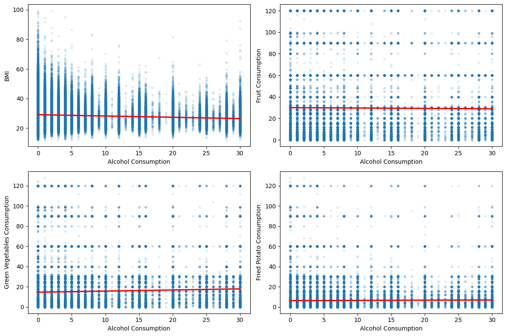
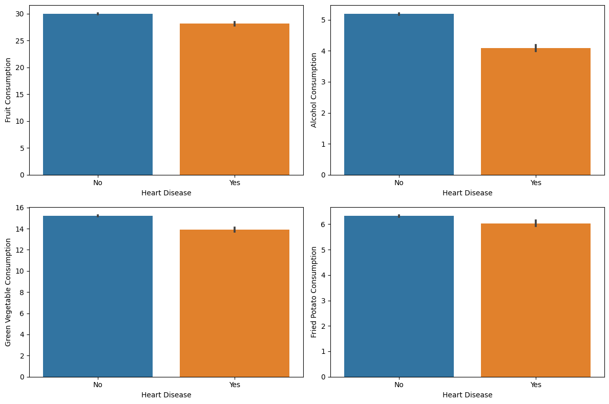

# Data Analysis
____

The purpose of this analysis is to perform feature selection from the dataset. Identifying columns that directly influence machine learning results is key to achieving an optimized dataset and improved model performance. To start the analysis, I had to understand the shape of this dataset, identify columns containing categorical variables, and find the number of missing values.

```Python
print(disease_data.shape)
print(disease_data.isnull().any())
print(disease_data.dtypes)
print(disease_data["Age_Category"].unique())
```
The output showed that this dataset consisted of __308,854__ rows and __19__ columns, with __12__ of them being _categorical_ _variables_, and there were __no missing values__. The absence of missing values simplified the process of data analysis because there was __no need to drop or replace values__. This allowed us not to conduct performance analysis for replaced variables. Furthermore, __all columns had distinct data types__ and did not require converting them into other types for analysis.
Having retrieved the necessary information, I moved to analyze the relationship between general health and exercising (both of which were categorical variables)
```Python
general_health_order = ["Poor", "Fair", "Good", "Very Good", "Excellent"]

sns.countplot(x="General_Health", data=disease_data, order=general_health_order, hue="Exercise")
plt.ylabel("Count")
plt.xlabel("General Health")
plt.show()
```
.png)

The bar chart illustrates a robust correlation between exercise habits and overall health. In general, __individuals engaging in exercise tend to feel significantly better than those who do not__. The majority reported their health state to be in the ‘_good_,’ ‘_very_ _good_,’ or ‘_excellent_’ category.
In order to investigate the potential connection between general health and BMI, I developed a bar plot. Furthermore, I decided to investigate whether there is a link between general health and depression. The code snippet below illustrates this procedure:
```Python
sns.barplot(x="General_Health", y="BMI", order=general_health_order,  data=disease_data)
plt.xlabel("General Health")
plt.show()

sns.countplot(x="General_Health", hue="Depression", data=disease_data, order=general_health_order)
plt.xlabel("General Health")
plt.ylabel("Count")
plt.show()

sns.countplot(x="Exercise", hue="Depression", data=disease_data)
plt.xlabel("Exercise")
plt.ylabel("Count")
plt.show()
```

.png)

A correlation is observed between general health and BMI, where a __lower BMI indicates better overall health__. The second bar plot illustrates a link between general health and depression. When comparing the two values - ‘_poor_’ and ‘_excellent_’ - it becomes apparent that useful insights can be gained. Half of the people who report ‘_poor_’ health conditions also suffer from depression, while those who feel ‘_excellent_’ are mostly not depressed. There is a strong relationship between this outcome and the results from the previous bar plot, indicating a correlation between general health and exercise. The main insight is that __more exercise results in alleviating depression__.
In order to directly observe this link, I developed another bar plot that depicts the interdependence of depression and exercise:

.png)

Since BMI affects general health, I opted to investigate the relationship between diet and BMI:


There is a noticeable __upward incline in the trend line__, which is in line with my expectations.
Subsequently, I generated four visual representations of various numeric and categorical variables, each of which requires thorough investigation. The code snippet below illustrates the procedure for producing the charts:
```Python
fig, axes = plt.subplots(nrows=2, ncols=2, figsize=(12, 8))

general_health_order = ["Poor", "Fair", "Good", "Very Good", "Excellent"]
age_category_order = ['18-24', '25-29', '30-34', '35-39', '40-44', '45-49', '50-54', '55-59', '60-64', '65-69', '70-74', '75-79', '80+']

sns.countplot(x="General_Health", hue="Exercise", data = disease_data, order=general_health_order, ax=axes[0, 0])
axes[0, 0].set_xlabel("General Health")
axes[0, 0].set_ylabel("Count")

sns.barplot(x='General_Health', y='Alcohol_Consumption', data=disease_data, order=general_health_order, estimator='mean', ax=axes[0, 1])
axes[0, 1].set_xlabel("General Health")
axes[0, 1].set_ylabel("Alcohol Consumption (mean)")

sns.countplot(x="Age_Category", hue="Exercise", data=disease_data, order=age_category_order, ax=axes[1, 0])
axes[1, 0].set_xlabel("Age Category")
axes[1, 0].set_ylabel("Count")
axes[1, 0].set_xticklabels(axes[1, 0].get_xticklabels(), rotation=45, ha='right')

sns.barplot(x='Smoking_History', y='Alcohol_Consumption', data=disease_data, estimator='mean', ax=axes[1, 1])
axes[1, 1].set_xlabel("Smoking History")
axes[1, 1].set_ylabel("Alcohol Consumption (mean)")

plt.tight_layout()
plt.show()
```


The graph presenting the interplay of age groups and exercise is connected with the general health and exercise graph.
An interesting phenomenon emerges in the graph illustrating how general health is linked to alcohol consumption. This chart indicates that __higher alcohol consumption is associated with better overall health__, which is extremely controversial and __requires additional research__. The connection between smoking history and alcohol consumption is robust and indicates that __people with a smoking history tend to consume more alcohol__.


This figure partially provides insight into what is depicted on the General Health vs Alcohol Consumption chart. __People who consume more alcohol tend to exercise more__, and, as illustrated previously, there is a __strong correlation__ between engaging in __exercise__ and __general health__. Therefore, __exercise might outweigh some negative effects of alcohol__. However, in order to make such a claim, it is crucial to conduct further research. This is why I decided to examine the link between alcohol consumption and diet. It is already known that BMI affects general well-being, as shown in the chart I generated earlier:



It is clear __there isn't a strong connection between diet and alcohol consumption__, but _there is a slightly negative incline of a trend line on the Alcohol Consumption vs BMI chart_. This could be one more reason why the variable __'Alcohol Consumption' is noisy__. In order to finally conclude whether this variable is relevant for developing a machine learning model, I decided to generate graphs of the direct association between heart disease and diet, which includes alcohol consumption.
```Python
fig, axes = plt.subplots(nrows=2, ncols=2, figsize=(12, 8))

sns.barplot(x='Heart_Disease', y='Fruit_Consumption', data=disease_data, ax=axes[0, 0])
axes[0, 0].set_xlabel("Heart Disease")
axes[0, 0].set_ylabel("Fruit Consumption")

sns.barplot(x='Heart_Disease', y='Alcohol_Consumption', data=disease_data, ax=axes[0, 1])
axes[0, 1].set_xlabel("Heart Disease")
axes[0, 1].set_ylabel("Alcohol Consumption")

sns.barplot(x='Heart_Disease', y='Green_Vegetables_Consumption', data=disease_data, ax=axes[1, 0])
axes[1, 0].set_xlabel("Heart Disease")
axes[1, 0].set_ylabel("Green Vegetable Consumption")

sns.barplot(x='Heart_Disease', y='FriedPotato_Consumption', data=disease_data, ax=axes[1, 1])
axes[1, 1].set_xlabel("Heart Disease")
axes[1, 1].set_ylabel("Fried Potato Consumption")

plt.tight_layout()
plt.show()
```


As shown in this visual representation, _those who follow a diet perform slightly better in terms of health issues_, but the _association between diet and heart disease is not strong enough to make confident conclusions_. On the other hand, the figure suggests that __higher alcohol consumption is associated with a lower risk of heart disease__. This result contradicts many scientific papers that have researched the impact of alcohol on an individual’s health. __This controversial result might be caused by the regular exercise of those who tend to drink__, and who also tend to follow a slightly better diet. But can the impact of exercising be that powerful? To answer this question, I formulated a graphic depiction of the correlation between heart disease and exercise:


Based on the information provided, ___exercise significantly reduces the risks of heart disease___. That is why I encountered controversial information about the impact of alcohol on health. _In this dataset, people who consume more alcohol tend to exercise more, which develops this strange relationship between alcohol and heart disease_.
Moving on, I studied the interplay of heart disease and cancer:


The bar chart illustrates that the _association between these variables is weak_. Furthermore, I would not like to include cancer-related information while conducting research on the risk of heart disease.
Lastly, I decided to study the connections between heart disease, smoking, and BMI:


As shown in the visual representation, _among people afflicted by heart disease, over 50% have or had a smoking habit_. _The tendency is the opposite for individuals, who do not suffer from heart disease_. The majority of them do not smoke. _This proves a robust correlation between smoking habits and heart disease_.
_The link between heart disease and BMI is extremely weak_, although it indicates that the _higher BMI is associated with a higher risk of heart disease_. Considering the chart, illustrating the relation between general health and BMI, _the lower BMI, the better overall well-being_.
And the last bar chart illustrates a correlation between individuals afflicted by heart disease and those who remain unaffected. This visualization is useful for figuring out the proportion between them.
## The Analysis Conclusion
____
Having conducted a thorough analysis of the dataset, I can conclude that out of all variables, the most controversial is alcohol consumption. An infinite number of scientific papers prove the negative effects of alcohol on an individual’s health, but it is the opposite in this dataset because of the strong connection with another crucial variable “exercise”. When developing the machine learning model, I will include and exclude alcohol consumption variables to calculate the accuracy.
# Cardiovascular Disease Risk Prediction
____
## Introduction
Cardiovascular disease (CVD) is a leading cause of mortality worldwide, making accurate risk prediction a critical area of research. This analysis aims to predict cardiovascular disease risk using a machine learning approach. By leveraging a dataset containing relevant health-related features, we explore the effectiveness of a Decision Tree classifier in identifying individuals at risk of cardiovascular diseases.
## Data Preparation
From the data analysis, we learned this data comprises various health-related features that could contribute to cardiovascular disease risk prediction. Among these features, a subset has been selected for analysis. The dataset was split into training and validation sets to facilitate model training and evaluation.
## Preprocessing
```Python
disease_data.columns.isnull()
y = disease_data.Heart_Disease
disease_features = ["Exercise", "Diabetes", "Arthritis", "Sex", "Age_Category", "BMI", "Smoking_History",
                     "Fruit_Consumption", "Green_Vegetables_Consumption", "FriedPotato_Consumption"]
X = disease_data[disease_features]

X_train, X_val, y_train, y_val = train_test_split(X, y, random_state=0)
s = (X_train.dtypes=='object')
object_cols = list(s[s].index)
drop_X_train = X_train.select_dtypes(exclude=['object'])
drop_X_valid = X_val.select_dtypes(exclude=['object'])

OH_encoder = OneHotEncoder(handle_unknown='ignore', sparse_output=False)
OH_cols_train = pd.DataFrame(OH_encoder.fit_transform(X_train[object_cols]))
OH_cols_valid = pd.DataFrame(OH_encoder.transform(X_val[object_cols]))
# OH encoding removed index; put it back
OH_cols_train.index = X_train.index
OH_cols_valid.index = X_val.index
# Remove categorical columns and replace them with one hot encoding
num_X_train = X_train.drop(object_cols, axis=1)
num_X_valid = X_val.drop(object_cols, axis=1)

# Add one hot encoded columns to numerical
OH_X_train = pd.concat([num_X_train, OH_cols_train], axis=1)
OH_X_valid = pd.concat([num_X_valid, OH_cols_valid], axis=1)

# Make sure all columns have dtype 'str'
OH_X_train.columns = OH_X_train.columns.astype('str')
OH_X_valid.columns = OH_X_valid.columns.astype('str')
```
## Model Selection and Training
A Decision Tree classifier was chosen for this analysis due to its interpretability and ability to capture non-linear relationships within the data. The Decision Tree model was trained using the preprocessed dataset, which consisted of both one-hot encoded categorical features and numerical features.
```Python
disease_model = DecisionTreeClassifier(random_state=1)
disease_model.fit(OH_X_train, y_train)
y_pred = disease_model.predict(OH_X_valid)
accuracy = accuracy_score(y_val, y_pred)
print(f"Accuracy: {accuracy: .2f}")
```
## Results and Evaluation
The trained Decision Tree classifier achieved an accuracy of approximately 86% on the validation set. This accuracy score indicates the proportion of correctly predicted instances out of the total validation set. While accuracy is an important metric, it's essential to consider its implications in the context of cardiovascular disease risk prediction.
